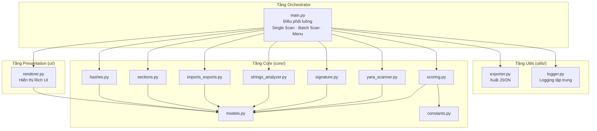
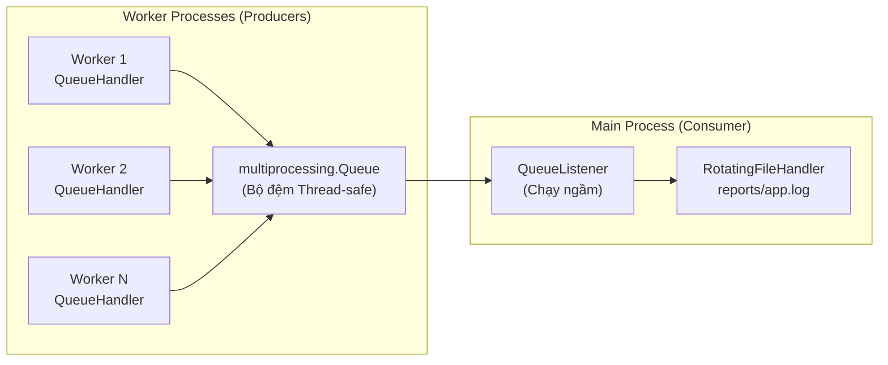

# BÁO CÁO KỸ THUẬT CHI TIẾT DỰ ÁN
# PE STATIC FEATURE EXTRACTOR — CÔNG CỤ PHÂN TÍCH TĨNH MÃ ĐỘC CẤU TRÚC PE

> **Đề tài:** Xây dựng công cụ phân tích tĩnh tệp thực thi Windows (PE — Portable Executable) phục vụ phát hiện sớm mã độc hại  
> **Công nghệ nền tảng:** Python 3.14 · pefile · yara-python · TLSH · Rich Terminal UI  
> **Trạng thái dự án:** Production-Ready Framework — Đã hoàn thiện giai đoạn kiến trúc cốt lõi

---

## MỤC LỤC

- [Chương 1: Tổng quan Đề tài & Đặt vấn đề](#chương-1-tổng-quan-đề-tài--đặt-vấn-đề)
- [Chương 2: Kiến trúc Hệ thống & Mô hình Dữ liệu](#chương-2-kiến-trúc-hệ-thống--mô-hình-dữ-liệu)
- [Chương 3: Chi tiết Triển khai các Module Phân tích Cốt lõi](#chương-3-chi-tiết-triển-khai-các-module-phân-tích-cốt-lõi)
- [Chương 4: Giải pháp Tối ưu Hiệu năng & An toàn Đa nhân](#chương-4-giải-pháp-tối-ưu-hiệu-năng--an-toàn-đa-nhân)
- [Chương 5: Kết quả Thử nghiệm & Đánh giá](#chương-5-kết-quả-thử-nghiệm--đánh-giá)
- [Chương 6: Kết luận & Hướng Phát triển](#chương-6-kết-luận--hướng-phát-triển)

---

# CHƯƠNG 1: TỔNG QUAN ĐỀ TÀI & ĐẶT VẤN ĐỀ

## 1.1. Bối cảnh: Mã độc cấu trúc PE và vai trò của Phân tích Tĩnh

Trong bối cảnh an ninh mạng toàn cầu ngày càng phức tạp, hệ điều hành Microsoft Windows vẫn giữ vị trí thống lĩnh thị phần máy trạm doanh nghiệp với hơn 72% thị phần (Statcounter, 2024). Điều này khiến định dạng **PE (Portable Executable)** — chuẩn nhị phân chính của Windows cho các tệp `.exe`, `.dll`, `.sys`, `.ocx` — trở thành vector tấn công hàng đầu mà các nhóm APT (Advanced Persistent Threat) và phần mềm độc hại (Malware) nhắm tới.

Định dạng PE được thiết kế bởi Microsoft vào năm 1993, kế thừa từ chuẩn COFF (Common Object File Format). Một tệp PE hoàn chỉnh bao gồm các thành phần cấu trúc chính:

| Thành phần | Vai trò | Ý nghĩa bảo mật |
|---|---|---|
| **DOS Header** + **DOS Stub** | Tương thích ngược với MS-DOS | Chứa Magic Number `MZ` (0x5A4D) |
| **PE Signature** | Dấu hiệu nhận dạng PE | Giá trị cố định `PE\0\0` (0x00004550) |
| **COFF File Header** | Siêu dữ liệu máy đích, số Section | Xác định kiến trúc (x86/x64) |
| **Optional Header** | Entry Point, Image Base, Data Directory | Chứa con trỏ tới bảng Import/Export |
| **Section Headers** | Ánh xạ vùng nhớ `.text`, `.data`, `.rsrc` | Phân vùng RWX là dấu hiệu nghi vấn |
| **Section Data** | Mã máy, dữ liệu, tài nguyên | Vùng chứa payload mã độc thực tế |

**Phân tích tĩnh (Static Analysis)** là phương pháp kiểm tra nội dung của tệp tin mà không cần thực thi (execute) chúng trong môi trường thực. Đây là lớp phòng thủ đầu tiên trong quy trình vận hành của một Trung tâm Giám sát An ninh Mạng (SOC — Security Operations Center), được thực hiện trước khi tiến hành phân tích động (Dynamic Analysis) trong môi trường cách ly (Sandbox). Ưu điểm cốt lõi của phân tích tĩnh bao gồm:

- **An toàn tuyệt đối:** Không kích hoạt payload độc hại vì tệp không được thực thi.
- **Tốc độ cao:** Có thể xử lý hàng nghìn mẫu trong thời gian ngắn.
- **Khả năng tự động hóa:** Phù hợp tích hợp vào các đường ống xử lý (Pipeline) của SOC.

Tuy nhiên, việc phân tích tĩnh thủ công bằng các công cụ rời rạc (PE Studio, CFF Explorer, YARA CLI) đòi hỏi chuyên viên phải mở nhiều công cụ song song, tự tổng hợp kết quả và đưa ra đánh giá chủ quan. Quy trình này tốn nhiều thời gian, dễ sai sót và không thể mở rộng quy mô (Scale) khi số lượng mẫu tăng đột biến.

## 1.2. Mục tiêu Đề tài

Xuất phát từ các hạn chế nêu trên, đề tài đặt ra mục tiêu xây dựng **PE Static Feature Extractor** — một công cụ dòng lệnh (CLI) tích hợp toàn diện, giải quyết trọn vẹn bài toán phân tích tĩnh tệp PE trong một luồng xử lý duy nhất (Single Unified Pipeline). Các mục tiêu kỹ thuật cụ thể bao gồm:

1. **Tự động hóa trích xuất đặc trưng nhị phân:** Trích xuất mã băm mật mã (MD5, SHA-256), mã băm nhập khẩu (Imphash), mã băm mờ (TLSH), phân tích phân vùng (Sections), và quét bảng Import/Export.
2. **Nhận diện mẫu mã độc bằng YARA:** Tích hợp engine quét `yara-python` để đối chiếu tệp với các bộ luật (Rule) tùy chỉnh.
3. **Kiểm tra chữ ký số Authenticode:** Xác minh sự tồn tại của chữ ký số nhằm phân tách nhanh phần mềm hợp pháp.
4. **Đánh giá rủi ro chuẩn hóa (Risk Scoring):** Triển khai thuật toán chấm điểm đa tiêu chí từ `0` đến `100` với 5 cấp độ phân loại, có khả năng nhận biết ngữ cảnh (Context-Aware) để giảm thiểu báo động giả (False Positive).
5. **Trích xuất và lọc thông minh các chỉ báo xâm nhập (IoC — Indicators of Compromise):** Cào chuỗi IPv4, IPv6, URL, Domain, Email, Registry Key, lệnh Shell bằng Biểu thức chính quy (Regex), đồng thời áp dụng Danh sách trắng (Whitelist) để loại bỏ nhiễu hệ thống.
6. **Hỗ trợ quét hàng loạt (Batch Scan):** Duyệt đệ quy thư mục, quét tuần tự toàn bộ tệp PE với thanh tiến trình trực quan, xuất bảng xếp hạng tệp nghi vấn.
7. **Xuất báo cáo JSON chuẩn hóa:** Đóng gói toàn bộ kết quả phân tích vào tệp JSON có cấu trúc, hỗ trợ tích hợp với các hệ thống SIEM/SOAR.

---

# CHƯƠNG 2: KIẾN TRÚC HỆ THỐNG & MÔ HÌNH DỮ LIỆU

## 2.1. Kiến trúc Phân tầng (Modular Layered Architecture)

Hệ thống PE Analyzer được thiết kế theo nguyên tắc **Tách biệt Trách nhiệm (Separation of Concerns — SoC)**, trong đó mỗi tầng chỉ đảm nhận một nhiệm vụ duy nhất và giao tiếp với các tầng khác thông qua các đối tượng dữ liệu đã được chuẩn hóa (Dataclass). Kiến trúc gồm 4 tầng chính:



### 2.1.1. Tầng Core — Logic xử lý chuyên sâu (`core/`)

Đây là tầng trung tâm chứa toàn bộ thuật toán phân tích nhị phân. Tầng Core bao gồm **7 module phân tích** độc lập, mỗi module nhận đầu vào là đối tượng `pefile.PE` (hoặc đường dẫn tệp) và trả về một đối tượng `Dataclass` đã được định nghĩa sẵn. Tầng Core tuân thủ nghiêm ngặt quy tắc **Defensive Tool Design**: mỗi module tự quản lý ngoại lệ nội bộ, không bao giờ để lỗi thô (raw exception) rò rỉ lên tầng gọi. Nếu xảy ra lỗi, module trả về đối tượng Dataclass với trường `status = "error"` và `error_message` chứa mô tả lỗi.

Ngoài ra, tầng Core chứa hai file hạ tầng quan trọng:

- [constants.py](pe_analyzer/core/constants.py): Tập trung toàn bộ hằng số cấu hình (ngưỡng Entropy, mốc điểm rủi ro, trọng số YARA, danh sách Whitelist). Khi cần thay đổi bất kỳ tham số nào, nhà phát triển chỉ cần sửa duy nhất file này.
- [models.py](pe_analyzer/core/models.py): Khai báo 9 Dataclass chuẩn hóa làm "hợp đồng dữ liệu" (Data Contract) giữa các tầng.

### 2.1.2. Tầng Orchestrator — Điều phối luồng (`main.py`)

File [main.py](pe_analyzer/main.py) (580 dòng) đóng vai trò **Entry Point** và **Bộ điều phối trung tâm** của ứng dụng. Tầng này không chứa bất kỳ logic phân tích nào mà chỉ thực hiện:

- Khởi tạo hệ thống Logging toàn cục (`setup_global_logging()`).
- Biên dịch trước bộ luật YARA một lần duy nhất (`compile_yara_rules()`).
- Điều phối giao diện Menu (chọn chế độ Single Scan hoặc Batch Scan).
- Gọi tuần tự các module Core, thu thập kết quả và chuyển tiếp sang tầng Presentation.
- Quản lý vòng đời đối tượng PE (`pe.close()` trong khối `finally`).

### 2.1.3. Tầng Presentation — Hiển thị giao diện (`ui/renderer.py`)

File [renderer.py](pe_analyzer/ui/renderer.py) (638 dòng) chịu trách nhiệm duy nhất là **trực quan hóa dữ liệu** ra terminal bằng thư viện `rich`. Tầng này nhận các đối tượng Dataclass từ tầng Orchestrator và chuyển đổi chúng thành các bảng biểu (`Table`), khối thông tin (`Panel`), thanh tiến trình (`Progress`), và dải phân cách (`Rule`) với hệ thống mã màu chuẩn SOC:

| Mã màu | Ý nghĩa | Hằng số |
|---|---|---|
| 🟢 `bold green` | An toàn / Đã ký số | `_CLR_SAFE` |
| 🟡 `bold yellow` | Cảnh báo / Cần xem xét | `_CLR_WARN` |
| 🔴 `bold red` | Nguy hiểm / Phát hiện mã độc | `_CLR_DANGER` |
| 🔵 `bold cyan` | Thông tin / Dữ liệu trung tính | `_CLR_INFO` |
| ⚪ `dim` | Thông tin phụ / Chú thích | `_CLR_DIM` |

Toàn bộ các đối tượng `Panel` và `Table` đều sử dụng kiểu viền `box.SQUARE` (viền vuông góc cạnh) thông qua cơ chế wrapper function, đảm bảo giao diện vuông vắn và không xê lệch ở mọi kích thước terminal.

### 2.1.4. Tầng Utils — Tiện ích hỗ trợ (`utils/`)

- [exporter.py](pe_analyzer/utils/exporter.py): Nhận các đối tượng Dataclass, sử dụng `dataclasses.asdict()` để chuyển đổi an toàn sang dictionary thuần trước khi serialize thành JSON. Báo cáo được lưu vào thư mục `reports/` với tên file có gắn timestamp.
- [logger.py](pe_analyzer/utils/logger.py): Khởi tạo hệ thống `RotatingFileHandler` ghi log xoay vòng vào `reports/app.log`, đảm bảo tách biệt hoàn toàn luồng log hệ thống và luồng hiển thị giao diện.

## 2.2. Chuẩn hóa Mô hình Dữ liệu — Loại bỏ "Primitive Obsession"

### 2.2.1. Vấn đề: Lạm dụng `Dict[str, Any]`

Trong giai đoạn phát triển ban đầu, tất cả các module phân tích trả về kết quả dưới dạng `Dict[str, Any]` — kiểu dữ liệu không có cấu trúc cố định. Mô hình này tồn tại nhiều khuyết điểm nghiêm trọng:

- **Mất an toàn kiểu (Type Safety):** IDE không thể gợi ý (auto-complete) các khóa của dictionary, lập trình viên dễ gõ sai tên khóa (ví dụ: `result["md_5"]` thay vì `result["md5"]`) mà chỉ phát hiện lỗi `KeyError` tại thời điểm chạy (Runtime).
- **Khó bảo trì:** Khi thêm hoặc đổi tên một trường dữ liệu, phải tìm kiếm và sửa thủ công ở mọi nơi sử dụng `.get("key")`.
- **Phụ thuộc ngầm (Implicit Coupling):** Không có "hợp đồng" rõ ràng giữa module sản sinh dữ liệu và module tiêu thụ dữ liệu.

### 2.2.2. Giải pháp: 9 Python Dataclasses trong `core/models.py`

Dự án đã triển khai việc thay thế toàn diện bằng 9 lớp dữ liệu (Dataclass) được định nghĩa tập trung trong file [models.py](pe_analyzer/core/models.py). File này được thiết kế theo nguyên tắc **Zero-Import** — không nhập bất kỳ module nội bộ nào của dự án để triệt tiêu nguy cơ import vòng (Circular Import).

```python
@dataclass
class HashResult:
    status: str = "success"
    error_message: str = ""
    md5: str = ""
    sha256: str = ""
    imphash: str = ""
    tlsh: str = ""
```

Bảng tổng hợp 9 Dataclass và vai trò:

| # | Dataclass | Module nguồn | Chức năng |
|---|---|---|---|
| 1 | `HashResult` | `hashes.py` | Lưu trữ mã băm MD5, SHA-256, Imphash, TLSH |
| 2 | `SignatureResult` | `signature.py` | Trạng thái chữ ký số Authenticode |
| 3 | `YaraResult` | `yara_scanner.py` | Danh sách các luật YARA khớp (matched rules) |
| 4 | `SectionInfo` | `sections.py` | Thông tin chi tiết một phân vùng PE |
| 5 | `SectionsResult` | `sections.py` | Tập hợp toàn bộ phân vùng của tệp PE |
| 6 | `ImportsExportsResult` | `imports_exports.py` | Bảng Import/Export và API nghi vấn |
| 7 | `IoCs` | `strings_analyzer.py` | Các chỉ báo xâm nhập (IP, URL, Domain, ...) |
| 8 | `StringsResult` | `strings_analyzer.py` | Kết quả trích xuất chuỗi và IoC |
| 9 | `ScoringResult` | `scoring.py` | Điểm rủi ro, mức độ, và danh sách lý do |

Lợi ích đạt được sau khi chuyển đổi:

- **IDE auto-complete:** Gõ `result.` sẽ hiển thị đầy đủ danh sách thuộc tính hợp lệ.
- **Phát hiện lỗi sớm:** Lỗi `AttributeError` xuất hiện ngay khi viết code (với mypy/Pylance) thay vì `KeyError` lúc runtime.
- **Serialize an toàn:** Hàm `dataclasses.asdict()` tự động đệ quy chuyển đổi toàn bộ cây đối tượng (bao gồm Dataclass lồng nhau như `IoCs` bên trong `StringsResult`) sang dictionary thuần, tương thích hoàn toàn với `json.dump()`.
- **Giá trị mặc định (Default Values):** Mỗi trường đều có giá trị mặc định hợp lý (`status = "success"`, các danh sách rỗng `field(default_factory=list)`), giúp module chỉ cần ghi đè các trường cần thiết.

---

# CHƯƠNG 3: CHI TIẾT TRIỂN KHAI CÁC MODULE PHÂN TÍCH CỐT LÕI

## 3.1. Module Hashes & Fuzzy Hashing (`core/hashes.py`)

### 3.1.1. Cơ chế kỹ thuật

Module [hashes.py](pe_analyzer/core/hashes.py) thực hiện việc tính toán bốn loại mã băm (Hash) khác nhau cho tệp PE:

| Loại Hash | Thuật toán | Thư viện | Mục đích |
|---|---|---|---|
| **MD5** | Message-Digest 5 (128-bit) | `hashlib` | Tra cứu nhanh trên cơ sở dữ liệu Threat Intelligence (VirusTotal, MalwareBazaar) |
| **SHA-256** | Secure Hash Algorithm 256-bit | `hashlib` | Định danh duy nhất (Unique Fingerprint) với xác suất va chạm cực thấp |
| **Imphash** | Import Hash | `pefile` | Phân nhóm các mẫu mã độc có cùng bảng Import (cùng họ Malware Family) |
| **TLSH** | Trend Micro Locality Sensitive Hash | `tlsh` | Đo lường độ tương đồng giữa các biến thể (Variant) mã độc |

### 3.1.2. Thuật toán TLSH — Băm mờ nhạy cảm vị trí

Khác với MD5/SHA-256 (chỉ cần thay đổi 1 bit đầu vào sẽ cho ra hash hoàn toàn khác — hiệu ứng Avalanche), **TLSH** được thiết kế để sinh ra giá trị hash **gần giống nhau** cho các tệp có nội dung tương tự. Nguyên lý hoạt động:

1. **Chia cửa sổ trượt (Sliding Window):** Dữ liệu đầu vào được duyệt qua cửa sổ 5 byte, tính toán các bộ ba (Triplet) từ chuỗi byte.
2. **Lượng tử hóa (Quartile Quantization):** Phân phối tần suất của các Triplet được chia thành 4 phần tư (Q1–Q4) và mã hóa thành chuỗi hash 72 ký tự hex.
3. **So sánh khoảng cách (Distance Scoring):** Hai giá trị TLSH có thể được so sánh bằng hàm `tlsh.diff()` — giá trị càng thấp thì hai tệp càng giống nhau.

Ứng dụng thực tế: Khi phát hiện một mẫu mã độc, chuyên viên SOC có thể sử dụng TLSH để quét toàn bộ hệ thống tìm kiếm các biến thể (Variant) chỉ khác nhau vài byte (ví dụ: thay đổi IP C2 Server trong phần data).

> [!NOTE]
> TLSH yêu cầu tệp đầu vào tối thiểu **50 byte** và đủ mức độ phức tạp (Complexity) để tính hash. Nếu tệp quá nhỏ hoặc quá đơn giản, module sẽ trả về chuỗi rỗng thay vì gây lỗi.

### 3.1.3. Graceful Degradation

Module áp dụng cơ chế **tự suy giảm chức năng** (Graceful Degradation): nếu thư viện `tlsh` chưa được cài đặt trong môi trường, biến cờ `TLSH_AVAILABLE` sẽ được đặt thành `False` và trường `tlsh` trong `HashResult` sẽ trả về chuỗi rỗng. Các mã băm còn lại (MD5, SHA-256, Imphash) vẫn hoạt động bình thường.

## 3.2. Module Phân tích Phân vùng & Entropy (`core/sections.py`)

### 3.2.1. Cấu trúc Phân vùng PE

Mỗi tệp PE chứa một hoặc nhiều **Section** (Phân vùng), mỗi phân vùng mang một vai trò riêng biệt:

| Section | Nội dung | Đặc điểm thường gặp |
|---|---|---|
| `.text` | Mã máy thực thi | Entropy trung bình (~6.0), cờ `READ + EXECUTE` |
| `.data` | Biến toàn cục đã khởi tạo | Entropy thấp (~3.0–5.0), cờ `READ + WRITE` |
| `.rdata` | Hằng số chỉ đọc | Entropy thấp |
| `.rsrc` | Tài nguyên (icon, manifest, .NET metadata) | Entropy cao ở file .NET là **bình thường** |
| `.reloc` | Bảng Relocation | Thường bị xóa trong mã độc |

### 3.2.2. Thuật toán Shannon Entropy

Module [sections.py](pe_analyzer/core/sections.py) triển khai hàm `calculate_entropy(data: bytes)` sử dụng công thức **Shannon Entropy** từ Lý thuyết Thông tin (Information Theory):

$$H(X) = -\sum_{i=0}^{255} p(x_i) \cdot \log_2 p(x_i)$$

Trong đó:
- $p(x_i)$ là xác suất xuất hiện của byte có giá trị $i$ trong tập dữ liệu.
- Giá trị $H$ nằm trong khoảng $[0, 8]$ (vì mỗi byte có $2^8 = 256$ giá trị khả dĩ).

Ý nghĩa thực tế của các mức Entropy:

| Khoảng Entropy | Ý nghĩa | Hành động |
|---|---|---|
| 0.0 – 4.0 | Dữ liệu có cấu trúc, lặp nhiều | Bình thường |
| 4.0 – 6.0 | Mã máy biên dịch thông thường | Bình thường |
| 6.0 – 7.2 | Nội dung hơi phức tạp | Theo dõi |
| **7.2 – 8.0** | **Dữ liệu nén hoặc mã hóa** | **Cảnh báo — Có thể bị Packed** |

Ngưỡng `7.2` được cấu hình tại hằng số `DEFAULT_ENTROPY_THRESHOLD` trong `core/constants.py`, cho phép nhà phát triển điều chỉnh linh hoạt.

### 3.2.3. Phân tích cờ Quyền truy cập (Permissions)

Hàm `get_permissions()` truy xuất trường `Characteristics` của mỗi Section Header để xác định ba cờ quyền:

```python
IMAGE_SCN_MEM_READ    = 0x40000000  # Quyền đọc
IMAGE_SCN_MEM_WRITE   = 0x80000000  # Quyền ghi
IMAGE_SCN_MEM_EXECUTE = 0x20000000  # Quyền thực thi
```

Một phân vùng có đồng thời cả ba cờ **RWX (Read + Write + Execute)** là dấu hiệu đặc biệt nghi vấn — hành vi này thường chỉ xuất hiện trong mã độc tự giải mã (Self-Modifying Code) hoặc Shell Code Injection.

## 3.3. Module Nhận diện Framework & Imports (`core/imports_exports.py`)

### 3.3.1. Quét bảng Import Address Table (IAT)

Module [imports_exports.py](pe_analyzer/core/imports_exports.py) truy xuất `pe.DIRECTORY_ENTRY_IMPORT` để lấy danh sách tất cả DLL và hàm API mà tệp PE sẽ gọi khi thực thi. Kết quả được tổ chức thành dictionary `{dll_name: [function_list]}`.

### 3.3.2. Phát hiện API nghi vấn (Suspicious APIs)

Module duy trì một tập hợp gồm **41 Windows API nguy hiểm** (hằng số `SUSPICIOUS_APIS`), được phân loại theo kỹ thuật tấn công MITRE ATT&CK:

| Nhóm kỹ thuật | API tiêu biểu | Mã MITRE |
|---|---|---|
| **Process Injection** | `CreateRemoteThread`, `VirtualAllocEx`, `WriteProcessMemory`, `NtUnmapViewOfSection` | T1055 |
| **Keylogging** | `SetWindowsHookExA`, `GetAsyncKeyState` | T1056.001 |
| **Network Communication** | `URLDownloadToFileA`, `InternetOpenA`, `HttpSendRequestA` | T1071 |
| **Anti-Analysis** | `IsDebuggerPresent`, `CheckRemoteDebuggerPresent` | T1622 |
| **Privilege Escalation** | `AdjustTokenPrivileges`, `OpenProcessToken` | T1134 |
| **Registry Manipulation** | `RegSetValueExA`, `RegCreateKeyExA` | T1112 |

Nếu tệp PE import hơn 5 API nghi vấn, điểm rủi ro sẽ bị cộng thêm 20 điểm (thay vì 10 điểm cho mức 1–5 API).

### 3.3.3. Nhận diện kiến trúc C# .NET Framework

Một trong những đóng góp quan trọng của module này là khả năng **nhận diện tệp PE được viết bằng C# .NET**. Logic phát hiện dựa trên đặc điểm kỹ thuật sau:

> Mọi tệp .NET đều import hàm `_CorExeMain` (hoặc `_CorDllMain`) từ thư viện `mscoree.dll` — đây là điểm vào (Entry Point) của Common Language Runtime (CLR).

Khi phát hiện tệp .NET, cờ `is_dot_net = True` được kích hoạt trong `ImportsExportsResult`. Giá trị này được truyền xuống **Scoring Engine** để thực hiện **False Positive Mitigation** — bỏ qua cảnh báo Entropy cao trên phân vùng `.rsrc` (vì tệp .NET thường nhúng metadata, manifest và tài nguyên nén trong phân vùng này, dẫn đến Entropy cao một cách hợp pháp).

## 3.4. Module Trích xuất IoC & Cơ chế Whitelist (`core/strings_analyzer.py`)

### 3.4.1. Trích xuất chuỗi ASCII/Unicode

Module [strings_analyzer.py](pe_analyzer/core/strings_analyzer.py) thực hiện quét toàn bộ nội dung nhị phân thô của tệp PE bằng biểu thức chính quy `[\x20-\x7E]{4,}` (các ký tự in được có chiều dài tối thiểu 4) để trích xuất tất cả chuỗi ASCII nhúng trong tệp.

### 3.4.2. Phân loại IoC bằng Regex chuyên biệt

Từ tập chuỗi thô, module áp dụng 8 bộ biểu thức chính quy được biên dịch sẵn (`re.compile`) tại module-level để phân loại thành các chỉ báo xâm nhập (IoC):

| Loại IoC | Mẫu Regex tiêu biểu | Ví dụ kết quả |
|---|---|---|
| **IPv4** | `\b\d{1,3}\.\d{1,3}\.\d{1,3}\.\d{1,3}\b` | `192.168.1.100`, `10.0.0.1` |
| **IPv6** | Pattern nhận diện chuẩn RFC 5952 | `fe80::1`, `2001:db8::1` |
| **URL** | `https?://[^\s\"'>]+` | `http://evil.com/payload.exe` |
| **Domain** | `[a-zA-Z0-9.-]+\.(com\|net\|org\|...)` | `malware-c2.xyz` |
| **Email** | `[a-zA-Z0-9._%+-]+@[a-zA-Z0-9.-]+\.[a-zA-Z]{2,}` | `ransom@protonmail.com` |
| **Registry** | `(HKEY_[A-Z_]+\|HKLM\|HKCU)\\[^\s\"]+` | `HKLM\Software\Microsoft\Windows\CurrentVersion\Run` |
| **Commands** | `(cmd\.exe\|powershell\|net user\|...)` | `powershell -enc ...` |
| **Wallets** | Pattern cho Bitcoin/Ethereum/Monero addresses | `1A1zP1eP5QGefi2DMPTfTL5SLmv7DivfNa` |

### 3.4.3. Cơ chế Whitelist — Màng lọc chống báo động giả

Đây là một trong những cơ chế phức tạp và quan trọng nhất của hệ thống. Tệp PE hợp pháp (ví dụ: bộ cài đặt .NET, trình duyệt Chromium) thường nhúng hàng chục đến hàng trăm chuỗi IP nội bộ, domain Microsoft/Google, và Namespace .NET trong phần metadata. Nếu không lọc, hệ thống sẽ báo cáo hàng loạt IoC giả, gây mất niềm tin của người dùng.

Hằng số `WHITELIST_PATTERNS` trong [constants.py](pe_analyzer/core/constants.py) định nghĩa **11 mẫu Regex biên dịch sẵn** (`re.compile`) để lọc bỏ:

| # | Nhóm Whitelist | Mẫu lọc tiêu biểu |
|---|---|---|
| 1 | **IP nội bộ RFC 1918** | `10.\d`, `192.168.\d`, `172.(16-31).\d` |
| 2 | **Loopback** | `127.\d.\d.\d` |
| 3 | **Localhost** | `localhost` |
| 4 | **Microsoft Domains** | `microsoft.com`, `windows.com`, `azure.com`, `live.com` |
| 5 | **Hãng chứng chỉ số (CA)** | `digicert.com`, `verisign.com`, `globalsign.com`, `letsencrypt.org` |
| 6 | **Apple** | `apple.com`, `icloud.com` |
| 7 | **Google** | `google.com`, `googleapis.com`, `gstatic.com` |
| 8 | **.NET Namespace** | `System.`, `Microsoft.`, `Windows.` (theo sau bởi chữ hoa) |
| 9 | **Chuỗi hệ thống** | `http://schemas.`, `xmlns`, `http://www.w3.org` |
| 10 | **Chuỗi phiên bản** | `\d+\.\d+\.\d+\.\d+` (dạng Version x.x.x.x) |
| 11 | **XML Namespace** | `urn:schemas-microsoft-com:` |

Hàm `_is_whitelisted(value: str) -> bool` duyệt tuần tự qua tất cả 11 mẫu. Nếu chuỗi khớp bất kỳ mẫu nào, nó bị loại khỏi kết quả IoC và bộ đếm `whitelisted_count` được tăng lên. Giá trị `whitelisted_count` được hiển thị trên giao diện để người dùng biết số lượng chuỗi đã bị lọc.

## 3.5. Module Kiểm tra Chữ ký số Authenticode (`core/signature.py`)

### 3.5.1. Cơ chế kỹ thuật

Module [signature.py](pe_analyzer/core/signature.py) kiểm tra sự tồn tại của **Chữ ký số Authenticode** bằng cách truy xuất phân vùng `IMAGE_DIRECTORY_ENTRY_SECURITY` trong mảng `DATA_DIRECTORY` của PE Optional Header.

```python
security_index = pefile.DIRECTORY_ENTRY['IMAGE_DIRECTORY_ENTRY_SECURITY']
security_dir = pe.OPTIONAL_HEADER.DATA_DIRECTORY[security_index]

if security_dir.VirtualAddress > 0 and security_dir.Size > 0:
    result.is_signed = True
```

> [!IMPORTANT]
> **Chi tiết kỹ thuật quan trọng:** Đối với mục `IMAGE_DIRECTORY_ENTRY_SECURITY`, trường `VirtualAddress` **không phải** là địa chỉ ảo (RVA) như các Data Directory khác. Thay vào đó, nó là **File Offset trực tiếp trên đĩa** — tức là vị trí vật lý (Physical Offset) của cấu trúc `WIN_CERTIFICATE` trong tệp nhị phân. Đây là trường hợp ngoại lệ duy nhất trong 16 mục Data Directory của PE. Lý do: khối chữ ký số không được ánh xạ vào không gian địa chỉ ảo (Virtual Address Space) khi hệ điều hành nạp (load) tệp PE vào bộ nhớ.

### 3.5.2. Cơ chế giảm điểm rủi ro

Khi `is_signed = True`, **Scoring Engine** sẽ áp dụng phần thưởng (Bonus) trừ điểm:

```python
score = max(0, score - BONUS_AUTHENTICODE_SIGNED)  # BONUS_AUTHENTICODE_SIGNED = 20
```

Giải thích logic: Một tệp PE có chữ ký số hợp lệ cho thấy tệp đó đã được một tổ chức xác định ký tên, tăng mức độ tin cậy. Tuy nhiên, module chỉ kiểm tra **sự tồn tại** (Presence) của chữ ký chứ chưa xác minh **tính hợp lệ** (Validity) — tức là chưa kiểm tra xem chữ ký có bị thu hồi (Revoked), hết hạn (Expired), hoặc chuỗi chứng chỉ (Certificate Chain) có đáng tin cậy hay không. Vì vậy, giao diện luôn hiển thị chú thích `"Presence Only — Validity Unverified"`.

## 3.6. Module Engine Quét YARA (`core/yara_scanner.py`)

### 3.6.1. Tổng quan về YARA

**YARA** (Yet Another Recursive Acronym) là một công cụ mã nguồn mở được thiết kế bởi Victor Alvarez tại VirusTotal, cho phép các nhà nghiên cứu mã độc tạo ra các **luật mô tả mẫu** (Pattern-Based Rules) để nhận diện và phân loại phần mềm độc hại. Mỗi luật YARA bao gồm:

- **Phần `strings`:** Khai báo các chuỗi byte, chuỗi text, hoặc biểu thức chính quy cần tìm kiếm.
- **Phần `condition`:** Điều kiện logic kết hợp các chuỗi để đưa ra kết luận.

Ví dụ luật YARA phát hiện mã độc có khả năng tự sao chép:

```yara
rule malware_self_copy {
    meta:
        description = "Detects self-copying malware"
        author = "SOC Team"
    strings:
        $api1 = "CopyFileA"
        $api2 = "GetModuleFileNameA"
        $path = "\\AppData\\Roaming\\" nocase
    condition:
        ($api1 and $api2) and $path
}
```

### 3.6.2. Tích hợp `yara-python`

Module [yara_scanner.py](pe_analyzer/core/yara_scanner.py) sử dụng thư viện `yara-python` (bản chính thức của VirusTotal) để biên dịch và quét.

> [!WARNING]
> **Lưu ý quan trọng:** Trên PyPI tồn tại hai thư viện có tên gần giống nhau: `yara-python` (bản chính thức, chứa engine C biên dịch sẵn) và `yara` (bản cũ của Michael Dorman, yêu cầu file `libyara.dll` thủ công). Cài nhầm bản `yara` sẽ gây ra lỗi `FileNotFoundError: Could not find module 'libyara.dll'` và làm sập toàn bộ ứng dụng.

Hàm `compile_yara_rules()` duyệt đệ quy thư mục `rules/`, thu thập tất cả file `.yar` và `.yara`, rồi gọi `yara.compile(filepaths=filepaths)` để biên dịch thành một đối tượng `yara.Rules` duy nhất. Đối tượng này được truyền lại cho hàm `scan_with_yara()` để quét.

### 3.6.3. Phân loại trọng số YARA trong Scoring Engine

Scoring Engine không đánh giá tất cả luật YARA bằng nhau mà phân loại theo **4 nhóm trọng số** dựa trên tiền tố (Prefix) tên luật:

| Tiền tố tên Rule | Nhóm | Trọng số (điểm) | Hằng số |
|---|---|---|---|
| `mal_` hoặc `malware` | Phát hiện mã độc trực tiếp | **+30** | `WEIGHT_YARA_MALWARE` |
| `pack` | Phát hiện Packer/Protector | **+20** | `WEIGHT_YARA_PACKER` |
| `crypto` | Phát hiện thuật toán mã hóa | **+10** | `WEIGHT_YARA_CRYPTO` |
| Khác | Luật chung | **+15** | `WEIGHT_YARA_GENERIC` |

Cơ chế này cho phép nhà phát triển viết luật YARA với mức độ ảnh hưởng khác nhau đến điểm rủi ro tổng thể. Ví dụ: một luật phát hiện mẫu byte của Cobalt Strike (`mal_cobalt_strike`) sẽ gây ảnh hưởng mạnh hơn rất nhiều so với một luật phát hiện thuật toán mã hóa AES thông thường (`crypto_aes_constants`).

---

# CHƯƠNG 4: GIẢI PHÁP TỐI ƯU HIỆU NĂNG & AN TOÀN ĐA NHÂN

## 4.1. Giải pháp Pre-compile YARA Rules

### 4.1.1. Phân tích vấn đề

Trong kiến trúc ban đầu, logic biên dịch luật YARA (`yara.compile()`) nằm **bên trong** hàm quét tệp `scan_with_yara()`. Điều này có nghĩa:

- Khi quét **1 file** (Single Scan): `yara.compile()` được gọi **1 lần** → Chấp nhận được.
- Khi quét **N file** (Batch Scan): `yara.compile()` được gọi **N lần** → **Lãng phí nghiêm trọng.**

Phép biên dịch YARA là thao tác tốn kém CPU vì engine phải phân tích cú pháp (Parse), tối ưu hóa (Optimize) và biên dịch thành automata hữu hạn (Aho-Corasick DFA) cho tất cả các chuỗi trong tập luật. Nếu bộ luật chứa hàng trăm rule với hàng nghìn chuỗi, mỗi lần compile có thể mất từ 100ms đến vài giây.

### 4.1.2. Giải pháp: O(N) → O(1)

Dự án đã tách hàm `compile_yara_rules()` thành một **hàm public độc lập** và gọi nó **duy nhất một lần** trong hàm `main()` tại thời điểm khởi động ứng dụng:

```python
def main() -> None:
    setup_global_logging()
    logger = get_app_logger()
    logger.info("PE Analyzer bắt đầu khởi chạy.")

    compiled_rules = compile_yara_rules()  # Biên dịch 1 lần duy nhất
    # ... Sử dụng compiled_rules cho mọi lần quét sau đó
```

Đối tượng `compiled_rules` (kiểu `yara.Rules`) sau đó được **truyền theo tham chiếu** (Pass-by-Reference) vào mọi lời gọi `scan_with_yara(file_path, compiled_rules)` — cả trong Single Scan lẫn vòng lặp Batch Scan. Kết quả:

| Chỉ số | Trước tối ưu | Sau tối ưu |
|---|---|---|
| Số lần compile cho N file | **N lần** | **1 lần** |
| Độ phức tạp biên dịch | O(N) | O(1) |
| Tăng tốc ước tính (N=1000) | Baseline | **~99.9% thời gian biên dịch bị loại bỏ** |

## 4.2. Kiến trúc Logging An toàn Đa nhân (Process-Safe Logging Architecture)

### 4.2.1. Phân tích vấn đề Race Condition

Khi chạy Batch Scan, nhiều tệp PE được xử lý tuần tự trong một tiến trình. Tuy nhiên, kiến trúc hệ thống đã được chuẩn bị sẵn sàng cho việc nâng cấp sang **đa tiến trình** (`ProcessPoolExecutor`) trong tương lai. Khi đó, nếu sử dụng `open("app.log", "a")` trực tiếp từ nhiều tiến trình con (Worker Process), sẽ xảy ra hiện tượng **Race Condition** — nhiều tiến trình đồng thời cố gắng ghi vào cùng một file, dẫn đến:

- Các dòng log bị xáo trộn, ghi đè lẫn nhau.
- Lỗi `PermissionError` trên Windows khi file bị khóa (File Locking).
- Mất dữ liệu log quan trọng.

### 4.2.2. Giải pháp: Kiến trúc Queue-based Logging

Hệ thống triển khai mô hình **Producer-Consumer** cho logging, sử dụng ba thành phần chính từ thư viện chuẩn Python:



**Luồng hoạt động:**

1. **Tiến trình chính** gọi `setup_batch_logging()` để tạo `multiprocessing.Queue` và khởi động `QueueListener` chạy ngầm (daemon thread).
2. **Mỗi Worker** được cấu hình `configure_worker_logger()` với `QueueHandler` — tất cả bản ghi log (LogRecord) được đẩy vào Queue thay vì ghi file trực tiếp.
3. `QueueListener` ở tiến trình chính liên tục rút các LogRecord từ Queue và chuyển tiếp cho `RotatingFileHandler` — đây là điểm ghi file **duy nhất và độc quyền**.
4. Sau khi Batch Scan hoàn tất, `listener.stop()` được gọi trong khối `finally` để đảm bảo tất cả log còn trong buffer được flush ra đĩa.

### 4.2.3. Hợp nhất Logging toàn cục

Module [logger.py](pe_analyzer/utils/logger.py) đóng vai trò **Single Source of Truth** cho mọi cấu hình logging:

```python
def setup_global_logging() -> logging.Logger:
    logger = logging.getLogger("PE_Analyzer")
    logger.setLevel(logging.INFO)
    logger.propagate = False  # QUAN TRỌNG: Ngăn log rò rỉ ra stdout

    file_handler = RotatingFileHandler(
        log_path,
        maxBytes=5*1024*1024,   # Xoay vòng khi đạt 5MB
        backupCount=3,           # Giữ tối đa 3 file backup
        encoding="utf-8"
    )
    file_handler.setFormatter(get_standard_formatter())
    logger.addHandler(file_handler)
    return logger
```

Thuộc tính `logger.propagate = False` là chìa khóa kỹ thuật quan trọng nhất: nó ngăn chặn các bản ghi log leo lên Root Logger (vốn có StreamHandler mặc định hướng ra `stderr`), từ đó **bảo vệ tuyệt đối** giao diện `rich.console` và thanh tiến trình `rich.progress` khỏi bị chèn xen bởi các dòng log thô.

Cả hai luồng quét (Single Scan và Batch Scan) đều sử dụng chung:
- **Cùng tệp log:** `reports/app.log`
- **Cùng Formatter:** `[%(asctime)s] [%(levelname)s] [%(module)s:%(lineno)d]: %(message)s`
- **Cùng cơ chế xoay vòng:** `RotatingFileHandler` (5MB × 3 backup)

---

# CHƯƠNG 5: KẾT QUẢ THỬ NGHIỆM & ĐÁNH GIÁ

## 5.1. Kịch bản Thử nghiệm Thực tế

### 5.1.1. Kịch bản 1: Hiệu quả của cơ chế Context-Aware Scoring

Để minh họa sức mạnh của bộ chấm điểm nhận biết ngữ cảnh, xét trường hợp phân tích một file cài đặt phần mềm sạch viết bằng C# .NET, có chữ ký số Authenticode hợp lệ.

**Nếu KHÔNG có cơ chế Context-Aware:**

| Yếu tố | Điểm cộng | Giải thích |
|---|---|---|
| Section `.rsrc` có Entropy 7.8 | +15 | Vượt ngưỡng 7.2 |
| Section `.text` có Entropy 7.3 | +15 | Vượt ngưỡng 7.2 |
| Phát hiện 12 IP nội bộ (localhost, 10.x.x.x) | +10 | Có IoC IPv4 |
| Phát hiện 8 URL Microsoft/Google | +10 | Có IoC URL |
| Import 3 API nghi vấn | +10 | Có Suspicious APIs |
| **Tổng cộng** | **60** | **⚠️ MEDIUM Risk — Báo động giả!** |

**VỚI cơ chế Context-Aware (Hệ thống hiện tại):**

| Yếu tố | Điểm cộng | Giải thích |
|---|---|---|
| Section `.rsrc` Entropy 7.8 | **+0** | ⏩ Bỏ qua — phân vùng `.rsrc` của file .NET |
| Section `.text` Entropy 7.3 | +15 | Vượt ngưỡng (không ngoại lệ) |
| 12 IP nội bộ | **+0** | ⏩ Bị Whitelist lọc (RFC 1918 + Localhost) |
| 8 URL Microsoft/Google | **+0** | ⏩ Bị Whitelist lọc (Microsoft/Google domains) |
| 3 API nghi vấn | +10 | Có Suspicious APIs |
| Chữ ký số Authenticode | **−20** | ✅ Bonus giảm điểm |
| **Tổng cộng** | **5** | **✅ SAFE — Kết quả chính xác!** |

Kết quả cho thấy hệ thống đã giảm thành công từ **60 điểm (MEDIUM)** xuống **5 điểm (SAFE)**, loại bỏ hoàn toàn cảnh báo giả nhờ ba cơ chế phối hợp:
1. **Nhận diện .NET:** Bỏ qua Entropy `.rsrc`.
2. **Whitelist IoC:** Lọc sạch IP nội bộ và Domain hệ thống.
3. **Authenticode Bonus:** Giảm 20 điểm cho file đã ký.

### 5.1.2. Kịch bản 2: Phát hiện mã độc thực sự

Xét trường hợp phân tích một tệp PE độc hại thực tế (Trojan Downloader):

| Yếu tố | Điểm | Lý do |
|---|---|---|
| Section `.text` RWX (Read-Write-Execute) | +25 | Self-modifying code |
| Section `.data` Entropy 7.6 | +15 | Dữ liệu mã hóa |
| Import 8 API nghi vấn (CreateRemoteThread, VirtualAllocEx...) | +20 | Process Injection APIs (>5) |
| IoC: 2 IP công cộng lạ | +10 | C2 Server addresses |
| IoC: 3 URL download | +10 | Payload delivery URLs |
| YARA Rule `mal_trojan_downloader` | +30 | Khớp luật Malware |
| Không có chữ ký số | +0 | Không có Bonus |
| **Tổng cộng** | **100** | **🔴 CRITICAL — Phát hiện chính xác!** |

## 5.2. Đánh giá Ưu điểm

### 5.2.1. Tốc độ xử lý

Nhờ cơ chế Pre-compile YARA, thời gian phân tích mỗi tệp PE chỉ phụ thuộc vào kích thước tệp và độ phức tạp phân vùng, không còn bị ảnh hưởng bởi thời gian biên dịch luật. Trung bình, một tệp PE kích thước 5MB được phân tích hoàn tất trong khoảng 0.5–2 giây (bao gồm cả quét YARA).

### 5.2.2. Giao diện trực quan chuyên nghiệp

Hệ thống sử dụng thư viện `rich` với kiểu viền `box.SQUARE` thống nhất và hệ thống mã màu chuẩn SOC, mang lại trải nghiệm:

- **Bảng biểu (Table)** vuông vắn, không xê lệch ở mọi kích thước Terminal.
- **Dải ngăn cách (Rule)** tự động co giãn theo chiều rộng cửa sổ.
- **Menu tương tác (Panel)** với viền vuông chuẩn, không phụ thuộc vào phông chữ.
- **Thanh tiến trình (Progress Bar)** hiển thị khi quét hàng loạt với thời gian ước tính.

### 5.2.3. Khả năng chống mất dữ liệu lỗi

Hệ thống Error Logging đảm bảo:

- Lỗi **định dạng PE** (`PEFormatError`): Tệp bị bỏ qua với trạng thái `"SKIP"`, vòng lặp quét tiếp tục bình thường.
- Lỗi **hệ thống/logic** (`Exception`): Ghi đầy đủ Traceback vào `reports/app.log` với thông tin file đang xử lý, không "nuốt" lỗi ngầm.
- **Crash một tệp không làm sập toàn bộ Batch Scan** — đây là đặc tính then chốt khi quét hàng nghìn mẫu.

---

# CHƯƠNG 6: KẾT LUẬN & HƯỚNG PHÁT TRIỂN

## 6.1. Kết luận

Dự án **PE Static Feature Extractor** đã hoàn thành xuất sắc giai đoạn xây dựng **bộ khung sản phẩm thực chiến (Production-Ready Framework)** với các thành tựu kỹ thuật nổi bật:

1. **Kiến trúc phần mềm vững chắc:** Hệ thống phân tầng rõ ràng (Core / Orchestrator / Presentation / Utils) tuân thủ nguyên tắc Separation of Concerns, cho phép mở rộng và bảo trì dễ dàng.

2. **Mô hình dữ liệu chuẩn hóa:** Chuyển đổi toàn bộ giao tiếp liên module từ `Dict[str, Any]` sang 9 Python Dataclasses, loại bỏ triệt để rủi ro `KeyError` và nâng cao trải nghiệm phát triển.

3. **Thuật toán chấm điểm nhận biết ngữ cảnh:** Scoring Engine kết hợp 6 nguồn dữ liệu phân tích (Sections, Imports, Strings/IoCs, YARA, Signature, .NET Detection) với cơ chế Whitelist chống báo động giả, đưa ra đánh giá rủi ro có độ chính xác cao.

4. **Tối ưu hiệu năng:** Pre-compile YARA đưa độ phức tạp biên dịch từ O(N) về O(1); cấu hình quản lý tập trung (`core/constants.py`) cho phép điều chỉnh nhanh.

5. **Hạ tầng Logging chuyên nghiệp:** Hệ thống RotatingFileHandler + QueueListener đảm bảo ghi log an toàn trong mọi tình huống, sẵn sàng cho kiến trúc đa tiến trình.

6. **Tài liệu kỹ thuật đầy đủ:** Quy tắc lập trình (`3_CODING_RULES.md`), theo dõi tiến độ (`2_PROGRESS_TRACKER.md`), và README chuyên nghiệp.

## 6.2. Hướng Phát triển — Giải quyết Nợ kỹ thuật (Technical Debt)

Để đưa dự án từ giai đoạn **Framework** lên **Production-Grade Application**, các hướng phát triển tiếp theo bao gồm:

### 6.2.1. Kiểm thử Tự động (Automated Testing)

- **Công nghệ:** `pytest` + `pytest-cov` (đo mức độ bao phủ mã nguồn).
- **Phạm vi:** Viết Unit Test cho `core/scoring.py` sử dụng dữ liệu Mock (tạo các đối tượng Dataclass giả lập) để kiểm tra tính chính xác của thuật toán chấm điểm ở mọi biên giá trị (Boundary Testing).
- **Mục tiêu:** Đạt tối thiểu 80% code coverage trên toàn bộ tầng Core.

### 6.2.2. Xử lý Song song (Parallel Processing)

- **Công nghệ:** `concurrent.futures.ProcessPoolExecutor`.
- **Ý tưởng:** Phân tán việc phân tích N tệp PE sang nhiều nhân CPU đồng thời, giảm thời gian Batch Scan tuyến tính từ O(N) xuống O(N/P) với P là số nhân CPU.
- **Thách thức:** Cần serialize đối tượng `compiled_rules` (yara.Rules) qua `pickle` giữa các tiến trình — có thể cần sử dụng kỹ thuật `yara.Rules.save()` / `yara.load()` với file tạm.

### 6.2.3. Đóng gói Môi trường (Containerization)

- **Công nghệ:** Docker + Docker Compose.
- **Lợi ích:** Đóng gói toàn bộ ứng dụng cùng dependencies (`yara-python`, `tlsh`, `pefile`) vào một container duy nhất, giải quyết triệt để các vấn đề "Works on my machine" và xung đột thư viện (`yara` vs `yara-python`).

### 6.2.4. Tích hợp & Triển khai Liên tục (CI/CD Pipeline)

- **Công nghệ:** GitHub Actions.
- **Pipeline đề xuất:**
  1. **Lint:** Chạy `flake8` / `ruff` kiểm tra quy chuẩn code.
  2. **Test:** Chạy `pytest` với code coverage report.
  3. **Build:** Đóng gói Docker image.
  4. **Release:** Tự động tạo GitHub Release với changelog.

### 6.2.5. Phân rã God Script (`main.py`)

- **Vấn đề:** File `main.py` hiện tại (580 dòng) vẫn đang đảm nhận quá nhiều trách nhiệm (Menu, Single Scan, Batch Scan, Logging).
- **Giải pháp:** Tách thành các lớp đối tượng: `CLIApp` (điều phối menu), `ScannerEngine` (quét luồng đơn), và `BatchProcessor` (quét luồng song song).

### 6.2.6. Chuyển đổi sang `src/` Layout

- **Ý tưởng:** Tái cấu trúc thư mục dự án theo chuẩn phân phối Python hiện đại, đưa toàn bộ mã nguồn ứng dụng vào `src/pe_analyzer/`, tách biệt hoàn toàn với thư mục tests, docs và scripts.

---

> **Ghi chú cuối:** Toàn bộ mã nguồn dự án được quản lý phiên bản bằng Git và lưu trữ tại repository GitHub. Các phiên bản thư viện phụ thuộc được cố định (Pinned) trong file `requirements.txt`: `rich==15.0.0`, `pefile==2024.8.26`, `yara-python==4.5.4`, `tlsh==0.2.0`.
